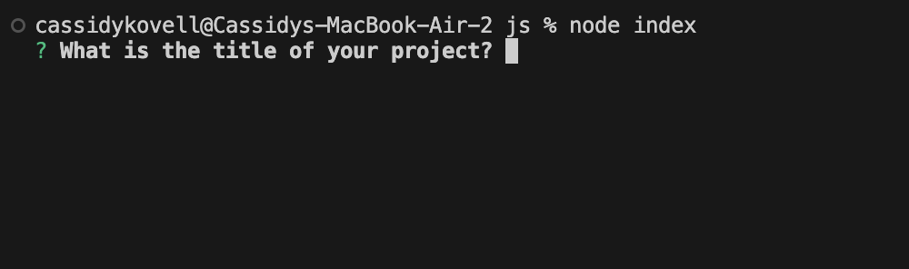

# professional-README

## Description
This command-line tool generates a professional REAME.

## Table of Contents
- [Installation](#installation)
- [Usage](#usage)
- [License](#license)
- [Contributing](#contributing)
- [Tests](#tests)
- [Questions](#questions)

## Installation
In order to install this tool you should clone the repository: git clone noe git@github.com:cassidykovell/professional-README.git, Then navigate to the directory and install the necessary dependencies: npm install & npm install inquirer@8.2.4

## Usage
To use this application type ‘node index’ in the command line and answer  the questions prompted to you.

## Credits
Cassidy Kovell with help from my class instructor and the Xpert Learning Assistant.

## License
N/A

## Badges

## Features 
This tool has the ability to generate a professional README for a project by prompting a user with questions pertaining to the README and then formatting and generating a README file.

## How to Contribute
N/A

## Tests
N/A 

## Questions
GitHub Username: cassidykovell
Github Profile link: https://github.com/cassidykovell
Email: cassidy0kovell@gmail.com 
If you have questions email me.
